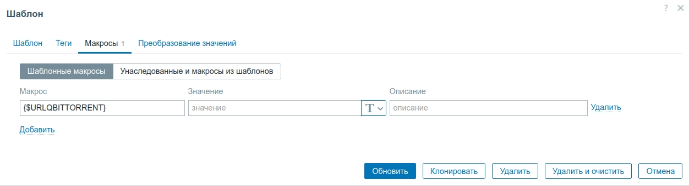

# Zabbix_template_qBittorrent_ru

## Описание
        
Шаблон для мониторинга qBittorrent
        
Основан на https://github.com/zabbix/community-templates/tree/main/Applications/template_qbittorrent

## Обзор
        
Шаблон для qBittorrent.
        
Вам необходимо изменить макрос "{$URLQBITTORRENT}". Укажите URL веб интерфейса qBittorrent с указанием порта (если существует).

         
В qBittorrent Вам необходимо изменить настройки аутентификации.

В конфигурации qBittorrent настройки:

WebUI\AuthSubnetWhitelistEnabled=true

WebUI\AuthSubnetWhitelist=0.0.0.0/0

В интерфейсе меню Сервис > Настройки > Веб-интерфейс в раздел "Пропускать аутентификацию клиентов из разрешённых подсетей" добавье IP-адрес zabbix сервера или zabbix прокси.

        
## Собираемые данные
        
- Состояние связи
- Отдано за сессию
- Лимит отдачи
- Версия qBittorrent
- Лимит загрузки
- Скорость отдачи
- Скорость загрузки
- Загружено за сессию
- Узлы DHT
- Всего отдано
- Всего загружено
- Общий рейтинг раздачи
- Потеряно за сеанс
- Подключённые пиры
- Попаданий в кэш чтения
- Общий размер буфера
- Перегрузка кэша записи
- Перегрузка кэша чтения
- Задачи ввода-вывода в очереди
- Среднее время в очереди
- Общий размер очереди
- Свободно на диске
- Состояние торрентов: Все		
- Состояние торрентов: Загружаются		
- Состояние торрентов: Раздаются		
- Состояние торрентов: Загрузка стоит		
- Состояние торрентов: Отдача стоит
        
        
## Автор
        
Исходный шаблон Antony Peronio (https://github.com/antonytayron)

Доработанная версия Lipin Roman (https://github.com/lipinra)

## Коллекция элементов

|Имя Ru|Имя En|Описание|Тип|Ключ|Время обновления|
|------|------|--------|---|----|----------------|
|Состояние связи|Conection Status|
-
|`Dependent item`|qbittorrent.connection_status|0|
|Отдано за сессию|Upload Data|
-
|`Dependent item`|qbittorrent.upldata|0|
|Лимит отдачи|Upload Limit|
-
|`Dependent item`|qbittorrent.upllimit|0|
|Версия qBittorrent|Version|
-
|`HTTP agent`|qbittorrent.version|0|
|Лимит загрузки|Download Limit|
-
|`Dependent item`|qbittorrent.dwllimit|0|
|Скорость отдачи|Upload Speed|
-
|`Dependent item`|qbittorrent.upload|0|
|-|qBittorrent transferInfo|
-
|`HTTP agent`|transferInfo|1m|
|Скорость загрузки|Download Speed|
-
|`Dependent item`|qbittorrent.download|0|
|Загружено за сессию|Download Data|
-
|`Dependent item`|qbittorrent.dwldata|0|
|Узлы DHT|DHT Nodes|
-
|`Dependent item`|qbittorrent.dht_nodes|0|
|Всего отдано|All time upload|
-
|`Dependent item`|qbittorrent.alltime_ul|0|
|Всего загружено|All time download|
-
|`Dependent item`|qbittorrent.alltime_dl|0|
|Общий рейтинг раздачи|Global ratio|
-
|`Dependent item`|qbittorrent.global_ratio|0|
|Потеряно за сеанс|Total wasted session|
-
|`Dependent item`|qbittorrent.total_wasted_session|0|
|Подключенные пиры|Total peer connections|
-
|`Dependent item`|qbittorrent.total_peer_connections|0|
|Попаданий в кэш чтения|Read cache hits|
-
|`Dependent item`|qbittorrent.read_cache_hits|0|
|Общий размер буфера|Total buffers size|
-
|`Dependent item`|qbittorrent.total_buffers_size|0|
|Перегрузка кэша записи|Write cache overload|
-
|`Dependent item`|qbittorrent.write_cache_overload|0|
|Перегрузка кэша чтения|Read cache overload|
-
|`Dependent item`|qbittorrent.read_cache_overload|0|
|Задачи ввода-вывода в очереди|Queued IO jobs|
-
|`Dependent item`|qbittorrent.queued_io_jobs|0|
|Среднее время в очереди|Average time queue|
-
|`Dependent item`|qbittorrent.average_time_queue|0|
|Общий размер очереди|Total queued size|
-
|`Dependent item`|qbittorrent.total_queued_size|0|
|Свободное место на диске|Free space on disk|
-
|`Dependent item`|qbittorrent.free_space_on_disk|0|
|Состояние торрентов: Все||
-
|`Dependent item`|qbittorrent.all|0|
|Состояние торрентов: Загружаются||
-
|`Dependent item`|qbittorrent.downloading|0|
|Состояние торрентов: Раздаются||
-
|`Dependent item`|qbittorrent.uploading|0|
|Состояние торрентов: Загрузка стоит||
-
|`Dependent item`|qbittorrent.stalledDL|0|
|Состояние торрентов: Отдача стоит||
-
|`Dependent item`|qbittorrent.stalledUP|0|